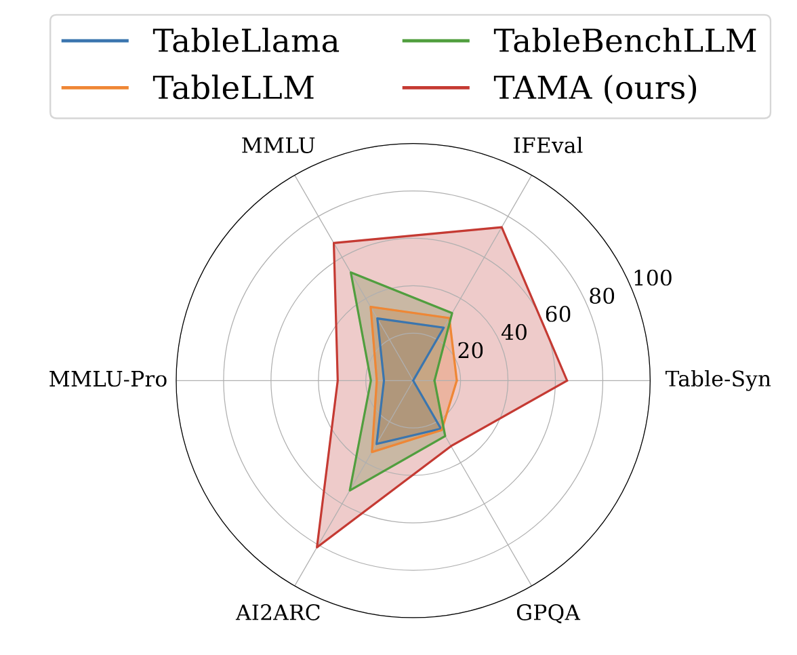

# TAMA: Rethinking Table Instruction Tuning

<div align="center">

</div>

This repository provides the overview and resources for the paper [*Rethinking Table Instruction Tuning*](https://arxiv.org/abs/2501.14693), published in ACL 2025 Findings.


## 🔥 News
 - 2025.6 We release the model checkpoints [models](https://huggingface.co/collections/MichiganNLP/tama-models-684eeb3e7f262362856eccd1)! 🤗
 - 2025.4 Our paper of **Rethinking Table Instruction Tuning** has been accepted by ACL 2025 Findings! 🎉

## 💡 Introduction
Recent advances in table understanding have focused on instruction-tuning large language models (LLMs) for table-related tasks. 
However, existing research has overlooked the impact of hyperparameter choices, and also lacks a comprehensive evaluation of the out-of-domain table understanding ability and the general capabilities of these table LLMs. 
In this paper, we evaluate these abilities in existing table LLMs, and find significant declines in both out-of-domain table understanding and general capabilities as compared to their base models. 

Through systematic analysis, we show that hyperparameters, such as learning rate, can significantly influence both table-specific and general capabilities.
Contrary to the previous table instruction-tuning work, we demonstrate that smaller learning rates and fewer training instances can enhance table understanding while preserving general capabilities.
Based on our findings, we introduce **TAMA**, a *TA*ble LLM instruction-tuned from LLa*MA* 3.1 8B Instruct, which achieves performance on par with, or surpassing GPT-3.5 and GPT-4 on table tasks, while maintaining strong out-of-domain generalization and general capabilities. 
Our findings highlight the potential for reduced data annotation costs and more efficient model development through careful hyperparameter selection.


## 🤗 How to Run TAMA

Starting with `transformers >= 4.43.0` onward, you can run conversational inference using the Transformers pipeline abstraction or by leveraging the Auto classes with the generate() function.

Make sure to update your transformers installation via `pip install --upgrade transformers`.

```
import transformers
import torch

model_id = "MichiganNLP/tama-5e-7"

pipeline = transformers.pipeline(
    "text-generation", model=model_id, model_kwargs={"torch_dtype": torch.bfloat16}, device_map="auto"
)

pipeline("Hey how are you doing today?")
```

You may replace the *prompt* with table-specific instructions. We recommend using the following prompt structure:

```
Below is an instruction that describes a task, paired with an input that provides further context. Write a response that
appropriately completes the request.

### Instruction:
{instruction}

### Input:
{table_content}

### Question:
{question}

### Response:
```

Here is a more detailed [example](examples/inference.py).

## 🏗️ Repository Structure

### `datasets`
Contains processed data derived from existing table understanding benchmarks and the combined datasets used for our hyperparameter exploration.

### `src`
Includes scripts for data processing, evaluation, and visualization. Follow the commands below to replicate experiments and plots presented in the paper:

- **Plot Generation**:
```
cd src/
python -m src.plots.llama31_feverous
```

- **Evaluation**:
```
cd src/
python -m src.evaluation.hitab
```

- **Data Processing**:
```
cd src/
python -m src.process_data.select_train_data
```

Additional scripts for other datasets and plots can be found within respective directories.


## 🛠️ Model Training and Inference

We utilize the [LLaMA Factory](https://github.com/hiyouga/LLaMA-Factory) library for model training and inference. Example YAML configuration files are provided under the `yamls` directory.

Modify the YAML configuration files to match your local environment:
- Adjust paths such as `deepspeed`, `dataset_dir`, and `output_dir`.
- Tune hyperparameters like `learning_rate`, `lr_scheduler_type`, and `per_device_train_batch_size` based on your computational resources.


### Example Training Command:
```
llamafactory-cli train yamls/train.yaml
```


For further guidance, detailed examples, or troubleshooting, please consult the original [LLaMA Factory documentation](https://github.com/hiyouga/LLaMA-Factory). You may also open issues directly in this repository or search existing solutions on the [LLaMA Factory GitHub](https://github.com/hiyouga/LLaMA-Factory/issues).


## 📖 Citations

Please kindly cite our paper if you use our code, data, models or results:

```
@misc{
deng2025rethinking,
title={Rethinking Table Instruction Tuning},
author={Naihao Deng and Rada Mihalcea},
year={2025},
url={https://openreview.net/forum?id=GLmqHCwbOJ}
}
```
